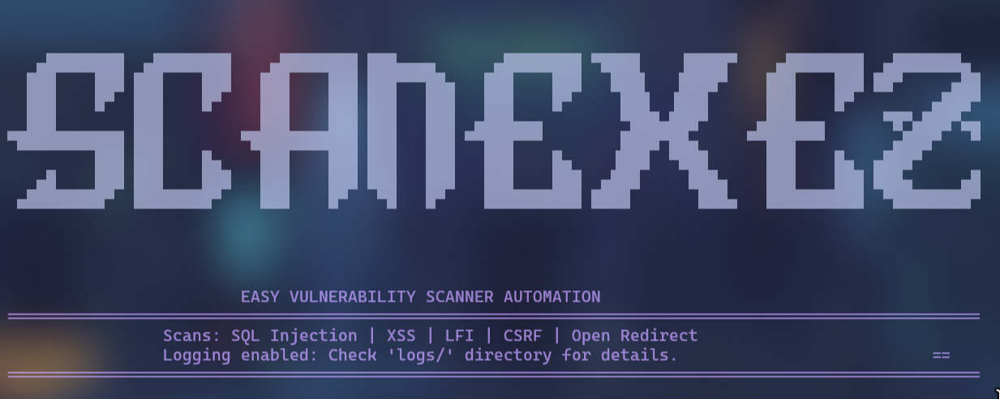

## ⚡️ ScanexEZ ⚡️


---

### **Your Ultimate URL Parameter Penetration Testing Tool**

---

## 🚀 Overview
**ScanexEZ** is a powerful and user-friendly URL parameter penetration testing tool built for ethical hackers, penetration testers, and security researchers. With a robust set of integrated tools and automation features, ScanexEZ simplifies the task of identifying vulnerabilities in URL parameters such as **SQL injection**, **XSS**, **LFI**, and **open redirects**, helping you enhance web application security.

---

## 🎯 Key Features
- 🔍 **Comprehensive Vulnerability Detection**: Supports testing for SQLi, XSS, LFI, CSRF, and open redirects.
- ⚙️ **Multi-Tool Integration**: Combines the power of tools like:
  - 🛠️ **SQLmap** – SQL injection detection and exploitation.
  - 🔒 **Dalfox** – XSS vulnerability detection.
  - 📂 **LFImap** – Local File Inclusion detection.
  - 🛡️ **XSRFProbe** – CSRF vulnerability detection.
  - 🧭 **OpenRedireX** – Open Redirect scanning.
- 🧩 **Python Virtual Environment**: Ensures an isolated environment for dependencies.
- ⚡ **Fast and Efficient**: Built for speed with optimized scanning algorithms.
- 🔄 **Cross-Platform Compatibility**: Works seamlessly on multiple Linux distributions.
- 🖥️ **User-Friendly Interface**: Minimal setup required to start scanning right away.

---

## ⚙️ Supported Distributions
- Arch Linux
- Debian/Ubuntu
- Fedora
- CentOS/RHEL
- openSUSE
> The installer automatically adapts to your Linux distribution and installs all necessary dependencies accordingly.

---

## 📥 Installation

### 🔧 Prerequisites
Ensure you have the following before starting:
- **Root or sudo privileges** are required to run the installation script.
- **Python 3.6+** must be installed on your machine.

### 🛠️ Installation Instructions
1. **Clone the Repository**:
   ```bash
   git clone https://github.com/Kentox493/ScanexEZ.git
   cd ScanexEZ
   
2. **Run the Installer:** The installation script is designed to automatically detect your Linux distribution and        install the necessary dependencies.
   ```bash
    sudo ./install.sh
   
3. **What Happens During Installation:**
    
  > - The installer updates your system's package list.
  > - Installs critical dependencies such as Python, Java, ZAP, and Go.
  > - Sets up a virtual environment in /opt/venvs/ScanexEZ.
  > - Clones and installs several security tools (SQLmap, Dalfox, OpenRedireX, etc.)
    - 
5. **Post-Installation:** After the installation completes, activate the virtual environment to use ScanexEZ.

---

### 🖥️ Usage
IMPORTANT: Activate the Virtual Environment First
Before running any commands, you must activate the virtual environment set up by the installer:

```bash
source /opt/venvs/ScanexEZ/bin/activate
```

**Run a Scan**: 
- Once the virtual environment is activated, run the ScanexEZ tool by executing the following command

```bash
sudo python3 ScanexEZ.py 
```
You will be presented with the ScanexEZ interface, which offers multiple scan options:
- Scans available:
- SQL Injection
- Cross-Site Scripting (XSS)
- Local File Inclusion (LFI)
- Cross-Site Request Forgery (CSRF)
- Open Redirect
- Run All Scans
> You can choose to scan a single URL or input a file with multiple URLs. Enter the target URL (for example: https://example.com/search?q=test) or the file path.


